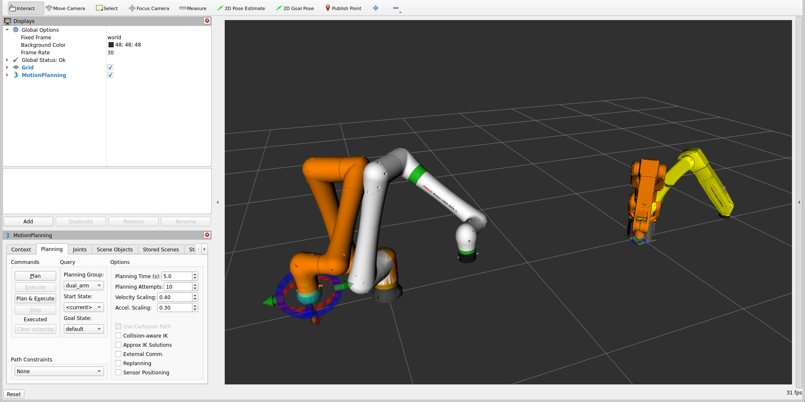
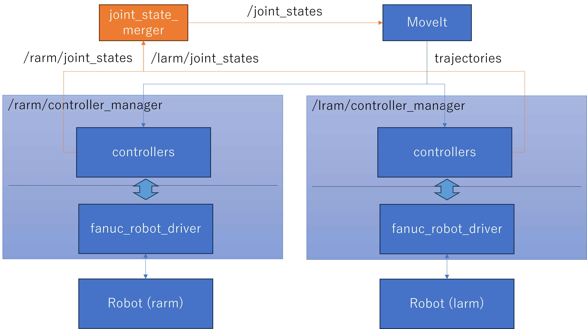

<!-- SPDX-FileCopyrightText: 2026 FANUC America Corp.
     SPDX-FileCopyrightText: 2026 FANUC CORPORATION

     SPDX-License-Identifier: Apache-2.0
-->
<!-- markdownlint-disable MD013 -->
# fanuc_dual_arm_example

## Overview

This package provides an example configuration for controlling two FANUC robots.

In this example, CRX-10iA/L is used as `rarm`, and LR Mate/7-9D (LR Mate 200iD/7L) is used as `larm`.

* Ensure that the relative position of the two robots are configured correctly. Incorrect configuration may cause severe collisions.
* The files in this package are provided only as examples. Please create configuration files appropriate for your own robot system.
* This package does not work with multi-group robot controllers. Each robot requires a separate controller.
* This package does not support two robots in a single workcell because ROBOGUIDE does not allow multiple ros2_control connections.

## Usage

Launch the example with a mock CRX-10iA/L and a physical LR Mate/7-9D:

```bash
ros2 launch fanuc_dual_arm_example fanuc_moveit.launch.py rarm_use_mock:=true larm_use_mock:=false larm_ip:=192.168.10.1
```



## System Architecture

* Each robot system runs under its own independent ros2_control controller manager.
* Set `moveit_ros_control_interface/Ros2ControlMultiManager` in MoveIt to allow detection of multiple controller managers.
* A special script, `joint_state_merger.py`, merges the two joint_states topics into a single topic to give all joints information to MoveIt.

