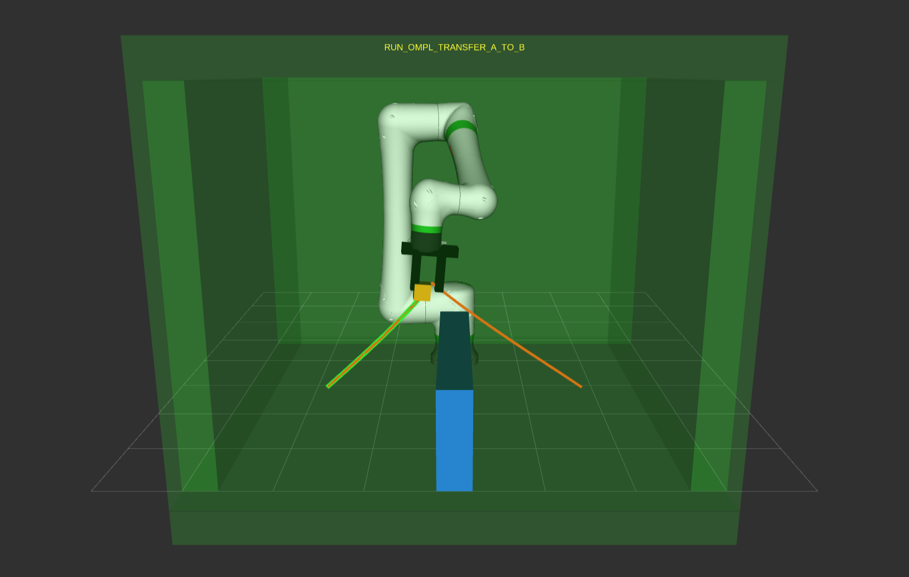

<!--
SPDX-FileCopyrightText: 2026 FANUC America Corporation
SPDX-FileCopyrightText: 2026 FANUC CORPORATION
SPDX-License-Identifier: Apache-2.0
-->
<!-- markdownlint-disable MD013 -->
# fanuc_pick_and_place_example

## Overview

This package demonstrates a repeating Pick & Place application with MoveItPy, OMPL, the Pilz industrial motion planner, and the FANUC ScaledJointTrajectoryController. One cycle is one complete Point A → Point B → Point A round trip.

The default coordinates are intended for the CRX-10iA/L(CRX/10-14A) example. Check all poses, collision objects, I/O, and speed settings before using a physical robot.

The supplied RViz configuration displays the robot, virtual hand and workpiece, collision boundaries, movable obstacle, selected trajectory, TCP path, progress, and current task state.



## Dependencies

This example requires the MoveItPy and Pilz industrial motion planner packages. Install them with:

```bash
sudo apt update
sudo apt install ros-jazzy-moveit-py ros-jazzy-pilz-industrial-motion-planner
```

## Environment

* Robot model: CRX-10iA/L (CRX/10-14A)
* Controller: R-30iB Mini Plus or R-50iA.

## Usage

Build the workspace and source its setup file before launching the example.

Run the example with mock hardware and one round trip:

```bash
ros2 launch fanuc_pick_and_place_example fanuc_pick_and_place_example.launch.py use_mock:=true max_cycles:=1
```

Run against a physical robot and one round trip:

```bash
ros2 launch fanuc_pick_and_place_example fanuc_pick_and_place_example.launch.py use_mock:=false robot_ip:=*.*.*.* max_cycles:=1
```

> **Note:** This example turns RO[1] ON and OFF during execution. Before connecting to and running the example on a physical robot, verify the robot motion in advance and ensure that the robot does not interfere with surrounding equipment or objects.

The default `max_cycles:=0` repeats until shutdown. A finite run exits the launch automatically after the requested number of round trips.

## Application parameters

The main parameters are in `config/pick_and_place.yaml`.

| Parameter group | Purpose |
| --- | --- |
| `home_joint_positions` | Initial HOME JOINT target |
| `pick.*` / `place.*` | Point A and Point B approach and task positions |
| `work.*` | Virtual workpiece dimensions and Point A/Point B positions |
| `obstacle.*` | Movable obstacle dimensions and initial position |
| `floor.*`, `ceiling.*`, `*_guard.*` | Individually enabled collision boundaries |
| `motion.ompl.*` | Transfer profiles, limits, endpoint tolerance, and orientation mode |
| `motion.linear.*` | Pilz LIN planning and speed settings |
| `hand.*` | hand I/O command/status and virtual hand dimensions |

The default `motion.ompl.preserve_orientation_during_transfer: true` constrains the saved HOME flange orientation over each complete OMPL transfer. Set it to `false` to constrain only each task-space goal orientation.

## Task sequence

Before the first cycle, `PickPlaceApplication.run()` performs three setup operations: (1) move to HOME and save the flange orientation, (2) open the hand and add the Planning Scene, and (3) move to the Point A approach pose.

Each cycle executes two legs, Point A → Point B and then Point B → Point A. The numbered comments in `PickPlaceApplication.run()` map directly to these steps:

1. Descend from the source approach to the Pick pose with Pilz LIN.
2. Close the hand and attach the workpiece.
3. Lift to the source approach with Pilz LIN.
4. Transfer to the destination approach with OMPL.
5. Descend to the Place pose with Pilz LIN.
6. Open the hand and return the workpiece to the world.
7. Retreat to the destination approach with Pilz LIN.
